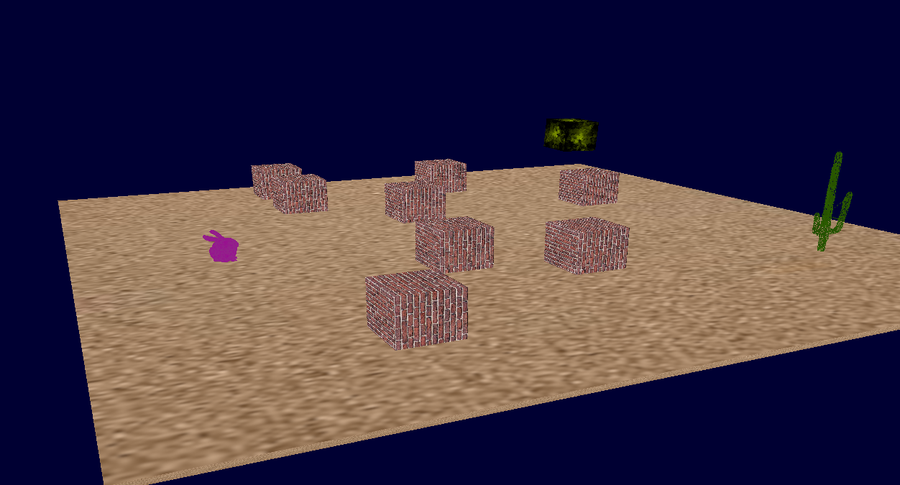

# BirchEngine
3D Engine made in OpenGL for school.

##### Screenshot of an example scene.


## Installation:

Install required dependencies:
- Ubuntu/Debian: `apt install build-essential cmake libglm-dev libsdl2-dev libglew-dev`
- Arch/Manjaro: `pacman -S base-devel cmake glm sdl2 glew`

```
git clone https://github.com/anteroul/BirchEngine.git
cd BirchEngine
mkdir build && cd build
cmake ..
make
./BirchEngine
```
